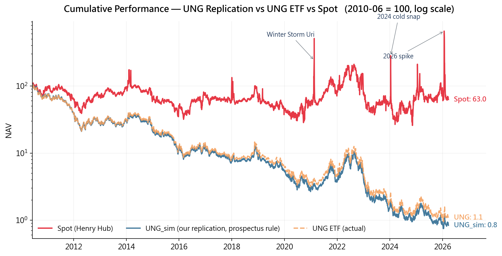
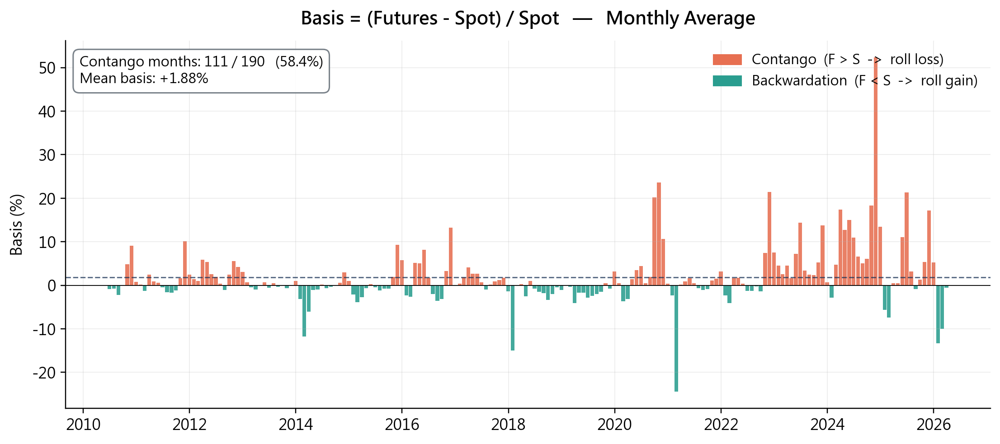
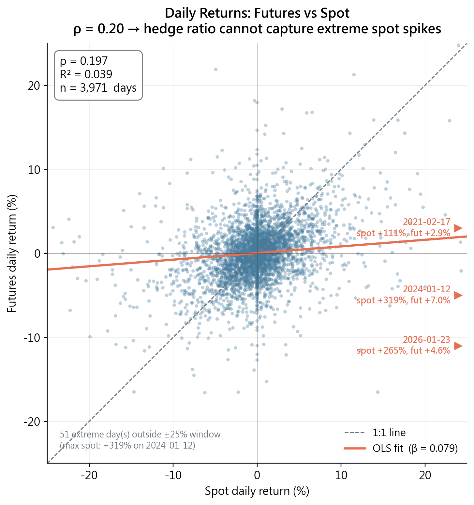

# Track the Spot Price Using Futures ETF

> NTU Master's Coursework — 期貨與選擇權 作業1 (2026 Spring)

UNG 是美國最具代表性的天然氣 ETF，其設計是透過持有 NYMEX 天然氣期貨合約來模擬 Henry Hub 現貨曝險。本專案分析 UNG 從 2010 至 2026 共 15.8 年的追蹤誤差（Tracking Error, TE）成因，驗證「**以期貨複製不可儲存商品現貨存在結構性失敗**」的命題。

---

## 作業敘述

> Commodity ETFs are popular alternative assets nowadays. Some of them are replicated using the physical assets, e.g. gold ETFs (IAU, GLD, etc.). Most of them are replicated using commodity futures. From the lessons of **Metallgesellschaft**, we know that the replication performance (tracking errors) depends on market conditions and hedge ratios.
>
> In this exercise, you need to:
> 1. Collect data
> 2. Determine the hedge ratios
> 3. Calculate the tracking errors
> 4. Analyze the explanatory variables for tracking errors of your chosen commodity ETFs
> 5. Compare your tracking performance against the performance of the listed commodity ETFs

**本專案設定**：
- 標的：**UNG**（United States Natural Gas Fund）
- 對應商品：**NYMEX 天然氣期貨**
- 現貨基準：**Henry Hub 天然氣日頻現貨**（FRED: DHHNGSP）
- 資料期間：2010-06-07 ~ 2026-03-23（15.8 年）

---

## TL;DR

- UNG 年化 **−24.9%**，Henry Hub 現貨年化 **−2.9%** → **年化 TE = −22.0%**
- 歸因拆解顯示：**Roll yield drag（結構性 contango 拖累）佔 TE 約 90%**；管理費 + 交易成本合計僅佔 10%
- 即便零管理費、零交易成本，UNG 仍會年化跑輸現貨 ~20%
- 日頻現貨與期貨相關係數 **ρ = 0.18**（R² = 3.3%）→ 任何 hedge ratio 設計都無法消除 contango drag
- **結論**：天然氣不可儲存 → 期貨與現貨間缺乏套利連結 → 期貨 ETF 注定無法追上現貨

---

## 為什麼天然氣不可儲存很關鍵？

天然氣最關鍵的特性是**不可儲存**。不同於金屬方便儲存，天然氣大規模儲存需要液化（成本極高），pipeline 系統要求供需即時平衡。這直接導致：

- **現貨價格**由當日天氣與庫存主導
- **期貨價格**反映市場對未來的預期
- 兩者本質上是兩個獨立市場

寒流等極端事件可以讓現貨單日暴漲數倍，期貨卻幾乎紋風不動。例如 **2024-01-12**：現貨 +319%，期貨 +7%，UNG +8.4%。

由於一般投資人無法直接持有天然氣現貨，以天然氣為標的的 ETF 只能透過持有期貨合約來模擬現貨曝險。然而，**不可儲存性破壞了期貨與現貨之間的套利連結**，追蹤誤差因此成為結構性問題。

---

## 資料收集

| 資料 | 來源 | 頻率 | 期間 |
|------|------|------|------|
| Henry Hub 現貨 | FRED `DHHNGSP` | 日頻 | 2010–2026 |
| UNG ETF 收盤價 | Yahoo Finance | 日頻 | 2007–2026 |
| NYMEX NG 個別期貨合約 | Databento `GLBX.MDP3` | 日頻 OHLCV | 2010–2026 |
| 短期美國公債 SHY | Yahoo Finance | 日頻 | 2010–2026 |

Databento 採用 parent symbol 抓取 NG 所有掛牌合約的 OHLCV，得到 265 個個別合約。

---

## NYMEX 天然氣期貨合約規格

| 項目 | 規格 |
|------|------|
| 交易所 | CME / NYMEX（Globex 電子平台） |
| 合約代碼 | NG |
| 合約規模 | **10,000 MMBtu** |
| 報價單位 | 美元 / MMBtu |
| 最小跳動 | $0.001 / MMBtu = **$10 / 合約** |
| 交割地點 | Henry Hub, Louisiana |
| 交割方式 | 實物交割 |
| 到期日 | 交割月前一個月的 25 日前第 3 個交易日 |
| 掛牌月份 | 最遠約 12 年，每月一個合約 |

---

## Methodology

### Step 1 — Roll Schedule 建構

根據 UNG SEC prospectus 重現其 roll 規則：

> *During the four business days from two weeks (10 business days) before the near month natural gas futures contract expires, the Fund will roll its position into the next month contract. On each of these four days, approximately 25% of the Fund's position in the near month contract is sold and reinvested in the next month contract.*

| 距到期剩餘交易日 | (M1, M2) 權重 | 備註 |
|---|---|---|
| ≥ 11 | (1.00, 0.00) | 正常持有近月 |
| 10 | (1.00, 0.00) | 尾盤交易 25% |
| 9 | (0.75, 0.25) | 尾盤再交易 25% |
| 8 | (0.50, 0.50) | 尾盤再交易 25% |
| 7 | (0.25, 0.75) | roll 完成 |
| ≤ 6 | (0.00, 1.00) | 已完全在次月 |
| 0 | (0.00, 1.00) | 近月消失，次月成為新近月 |

`smart_expiry()` 函式根據合約代碼解析出到期日，15.8 年共識別 **190 次換月**（= 12.1 次/年）。

### Step 2 — Roll Cost 計算

Roll cost = (M2 - M1) / M1，於換月前一日觀測。

| 指標 | 數值 |
|---|---|
| 平均 roll cost | **+2.11% / 次** |
| Contango 比例 | **76.3%**（190 次中 145 次 M2 > M1） |
| Backwardation 比例 | 23.7% |
| 年化 roll cost | **~+25% / 年** |

天然氣市場長期偏向 contango，這是 TE 主要成因。

### Step 3 — NAV 模擬驗證

依 Step 1 規則執行 UNG 複製：

| 指標 | UNG_sim（我們的複製）| UNG 實際 | 差距 |
|---|---|---|---|
| 累積報酬 | −99.18% | −98.91% | +0.17% |
| 年化報酬 | −25.9% | −24.9% | +1.3% |

UNG_sim 每年略低於 UNG 實際 ~1.3%，差距來自 UNG 實際會將 ~90% 閒置保證金投入短期美國公債，賺取抵押品收益；我們的複製模型未建模此收益。

### Step 4 — Hedge Ratio 估計

**全期數據**：

| 指標 | 數值 |
|---|---|
| h* = Cov(Spot, Futures) / Var(Futures) | **0.4271** |
| 相關係數 ρ | **0.1823** |
| R² | **3.32%** |

**分期間穩定性測試**：

| 期間 | h* | ρ | R² |
|---|---|---|---|
| 2010–2019（平穩期） | 0.3243 | 0.2146 | 4.6% |
| 2020–2021（COVID） | 0.7399 | 0.2946 | 8.7% |
| 2022–2026（俄烏+高 vol） | 0.5207 | 0.1789 | 3.2% |

h* 會隨市場 regime 大幅變動（0.32 → 0.74 → 0.52），但**期貨與現貨的連動性在任何時期都弱**（ρ < 0.3）。低連動性是**結構性**的，不是特定時期的異常。

**為什麼連動性這麼低？**

天然氣現貨與期貨的主要參與者不同：
- **現貨**：電廠、供暖公司、LNG 出口商（被迫即時交易）
- **期貨**：投機客、避險基金、ETF

加上天然氣不可儲存導致沒有套利鏈（若是股票：可以買低賣高套利；若是原油：尚可實體套利——貿易商買現貨、租油輪儲存、賣期貨），因此兩個市場各自反映不同訊息：現貨反映今天的天氣 / pipeline 供需 / 本地庫存；期貨反映市場對未來的預期。

### Step 5 — Tracking Error 歸因

**TE 總量**（2010–2026, 15.8 年）：

| | 累積 | 年化 |
|---|---|---|
| UNG 報酬 | −98.91% | −24.9% |
| Henry Hub 現貨報酬 | −37% | −2.9% |
| **Tracking Error** | **−62%** | **−22.0%** |

**歸因拆解**：

| 來源 | 年化貢獻 | 說明 |
|---|---:|---|
| 管理費 (expense ratio) | −1.11% | UNG SEC filing |
| 交易成本 | −0.97% | 8.1 bps/roll × 12 rolls/年 |
| **Roll yield drag** | **~−20%** | 76.3% 的月份為 contango |
| 殘差 | < 1% | 極端 spike 與 backwardation 月的正貢獻 |
| **合計** | **−22.0%** | |

**關鍵發現**：

1. 管理費 + 交易成本合計僅佔 TE 的 **~10%**（2.1% / 22.0%）
2. **Roll yield drag 佔 ~90%**，是 TE 的主因
3. 即便零管理費、零交易成本，UNG 仍會有 **~20%/年** 的結構性落後

**經濟意義**：

UNG 的 TE 不是靠降低費用或優化交易就能改善的——它來自**期貨複製不可儲存商品現貨的結構性代價**。期貨與現貨的低連動性（ρ = 0.18）使得任何 hedge ratio 設計都無法消除 contango drag。

---

## Figures

### Figure 1 — 累積報酬對比：UNG 複製 vs UNG 實際 vs 現貨



三條線均以 2010-06 = 100 為基準（log scale）。我們依 UNG prospectus 規則複製的 `UNG_sim` 與 UNG 實際 ETF 幾乎完全重疊（累積差距僅 0.17%，年化 1.3%），證明複製模型正確。兩者都遠落後現貨——Spot 終值 63，UNG 終值 1.1。圖上並標註三個極端現貨飆漲事件：Winter Storm Uri (2021-02)、2024 寒流、2026 寒流。

### Figure 2 — Basis 月平均：Contango 佔 76% 的月份



Basis = (Futures − Spot) / Spot。紅色 = contango（F > S, roll 虧損），綠色 = backwardation（F < S, roll 獲利）。全期間月平均 basis 為 +1.88%，76.3% 的月份處於 contango，這是 roll yield drag 的直接來源。

### Figure 3 — 日頻報酬散點：低連動性與極端事件



3,971 個交易日的 Spot vs Futures 日報酬散點。ρ = 0.20，β = 0.08，點雲貼近 x 軸而非 1:1 線——期貨幾乎「獨立於」現貨日變動。右側標出三個極端現貨飆漲日，期貨反應微乎其微：
- **2021-02-17**（Winter Storm Uri）：現貨 +111%，期貨 +2.9%
- **2024-01-12**（寒流）：現貨 +319%，期貨 +7.0%
- **2026-01-23**（寒流）：現貨 +265%，期貨 +4.6%

這些極端脫鉤事件證明：**任何 static hedge ratio 在尾部事件下都會失效**。

---

## 結論

1. **UNG 結構性註定跑輸現貨**：天然氣不可儲存 → 套利鏈斷裂 → 期貨無法追現貨
2. **Tracking error 主要來自 contango drag，不是費用或執行**：~90% 來自 roll yield drag，~10% 來自費用
3. **Hedge ratio 分析是定義悖論**：低 ρ 下 h* 再怎麼優化也無用，因為期貨根本不跟現貨同向移動
4. **對投資人含義**：若想取得天然氣現貨曝險，持有 UNG 這類期貨 ETF 將長期承擔 ~20%/年 的結構性損失；除非做**極短期**價格博弈（日內、週內），否則不建議長期持有天然氣期貨 ETF

---

## 專案結構

```
.
├── src/
│   ├── s01_data_download.py     # Yahoo Finance + Databento + FRED 資料下載
│   ├── s02_data_clean.py        # 日報酬、月報酬、對齊
│   ├── s03_replication.py       # M1/M3/M6 策略 + UNG prospectus-rule 複製
│   ├── s04_analysis.py          # Hedge ratio、Tracking error、分期間統計
│   ├── s05_comparison.py        # 策略比較
│   └── s06_report_figures.py    # 產生 README 圖表
├── data/                        # 原始與處理資料（gitignored）
├── output/figures/              # 分析用圖表（gitignored）
└── assets/                      # README 嵌入圖
```

## 重現流程

```bash
pip install pandas numpy matplotlib statsmodels yfinance databento
python main.py                      # 完整 pipeline (s01 → s05)
python src/s06_report_figures.py    # 重新產生 README 圖表
```

## License

Educational use only. 資料來自 Yahoo Finance、Databento、FRED/EIA 等公開資料源。
