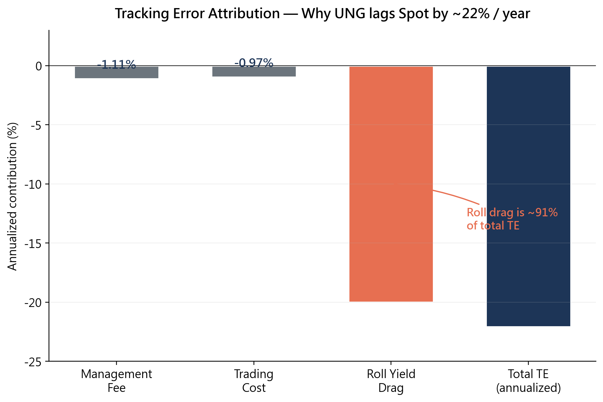

# Track the Spot Price Using Futures ETF

**NTU Master's Coursework — Futures & Options (2026 Spring)**
Using US natural gas ETF (UNG) to examine whether futures-based replication can track the spot of a non-storable commodity.

---

## TL;DR

- UNG replicates Henry Hub natural gas spot using front-month NYMEX NG futures.
- Over **2010–2026 (15.8 years)**, UNG returned **−24.9%/year** while spot returned **−2.9%/year**, a **−22%/year tracking error**.
- Decomposition shows **~91% of the tracking error comes from structural roll yield drag** (contango), not from management fees or execution.
- Conclusion: for **non-storable** commodities, no-arbitrage links between futures and spot break down — futures-based ETFs are structurally doomed to lag.

---

## Key Figures

### 1. Cumulative Performance — UNG Replication vs UNG ETF vs Spot


Our replication (`UNG_sim`) follows the UNG SEC prospectus rolling rule (4-day roll, starting 10 business days before expiry) and closely matches the actual UNG ETF. Both lag Henry Hub spot by ~2 orders of magnitude over the sample period. The residual ~1.3%/year gap between `UNG_sim` and actual UNG is explained by collateral yield on short-term Treasuries that the actual fund earns on idle cash — a factor not modeled in the replication.

### 2. Tracking Error Attribution



Decomposition of the −22%/year tracking error:

| Component | Contribution | Source |
|-----------|-------------:|--------|
| Management fee         | −1.11% | UNG SEC filing |
| Trading cost           | −0.97% | 8.1 bps/roll × 12 rolls/year |
| **Roll yield drag**    | **−20.00%** | Contango in 76% of monthly rolls |
| **Total**              | **−22.08%** | matches observed annualized TE |

Even with zero fees and perfect execution, UNG would still lag spot by ~20%/year because of the structural contango in natural gas futures. This is the study's central finding.

### 3. Daily Returns — Futures vs Spot


Daily returns scatter plot shows **ρ = 0.20** and **β = 0.08** — front-month futures move almost independently of Henry Hub spot at the daily horizon. Three extreme spot spike events (Winter Storm Uri in Feb 2021, and cold snaps in Jan 2024 / Jan 2026) are annotated on the right edge: spot moved +111%, +319%, and +265% respectively while front-month futures moved less than +10% on each date. This confirms that **no hedge ratio can capture the tail behavior** of natural gas spot via futures.

---

## Project Structure

```
.
├── src/
│   ├── s01_data_download.py     # Yahoo Finance + Databento ingestion
│   ├── s02_data_clean.py        # Returns, alignment, monthly resampling
│   ├── s03_replication.py       # M1/M3/M6 strategies + UNG prospectus-rule replication
│   ├── s04_analysis.py          # Hedge ratio, tracking error, sub-period stats
│   ├── s05_comparison.py        # Strategy comparison
│   └── s06_report_figures.py    # Report figures (fig 1–4)
├── data/                        # Raw + processed data (gitignored, re-downloadable)
├── output/figures/              # Generated figures (gitignored)
└── assets/                      # Figures embedded in this README
```

## Data Sources

- **Henry Hub spot** and **UNG ETF**: Yahoo Finance (daily)
- **NG futures (NYMEX)**: Databento outright contracts (1-month — 6-month expiries)
- **Short-term Treasuries (SHY)**: Yahoo Finance (collateral yield proxy)

## How to Reproduce

```bash
pip install pandas numpy matplotlib statsmodels yfinance databento
python main.py                   # run full pipeline (s01 → s05)
python src/s06_report_figures.py # regenerate report figures
```

## Methodology Notes

- **UNG prospectus replication**: during the 10–6 business-day window before near-month expiry, 25% of position is rolled on each of 4 days (weights 1.0 → 0.75 → 0.50 → 0.25 → 0.0 on M1).
- **Tracking error**: `UNG_annual_return − Spot_annual_return`, where returns come from close-to-close NAV with reinvestment.
- **Roll drag**: residual after subtracting management fee + trading cost from total TE; this is the structural cost of contango, independent of execution quality.
- **Spot reference**: Henry Hub settlement prices published by EIA, accessed via Yahoo Finance (ticker `NG=F` spot proxy).

## License

Educational use only. Data sourced from publicly available providers (Yahoo Finance, Databento, EIA).
